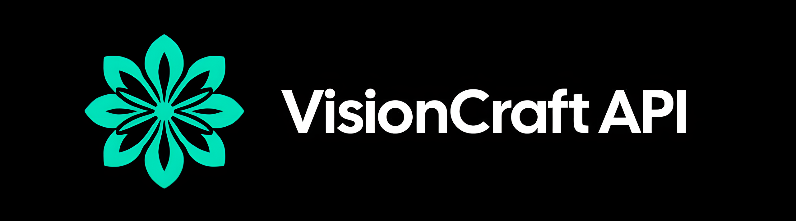

## Official links:
- [Telegram channel](https://t.me/visioncraft_channel)

## Introduction

The VisionCraft API is a **free** API for using over 3000 different AI models.

# Table of contents

## ✨ Getting started

* [Obtaining an API Key](getting-started/obtaining-an-api-key.md)
* [Subscriptions and limits](getting-started/subscriptions-and-limits.md)

## ❤️‍🔥 Interacting with the API

* StableDiffusion
  * SD 1.X
    * [Available Models](sd/sd/models.md)
    * [Available Loras](sd/sd/loras.md)
  * SDXL
    * [Available Models](sd/sdxl/models.md)
    * [Available Loras](sd/sdxl/loras.md)
  * [Available Samplers](sd/samplers.md)
  * [Image Generation](sd/image-generation.md)
* DALL•E-3
  * [Image Generation](dalle/generate.md)
* Leonardo.ai
  * [Image Generation](leonardo/generate.md)
* LLM
  * [Available Models](llm/available-models.md)
  * [Text Generation](llm/text-generation.md)
    * [Add image to request](llm/add-image-to-request.md)
* Text2GIF
  * [GIF Generation](text2gif/gif-generation.md)

## ℹ️ Contact Information

If you **have** any **questions** or requests, **feel free to reach out to us**. We are always **ready to assist** you.&#x20;

* [VisionCraft API](https://api.visioncraft.top/docs#/)
* [Telegram bot](https://t.me/VisionCraft\_bot)
* [Telegram channel](https://t.me/visioncraft\_channel)
* [Administrator](https://t.me/metimol)